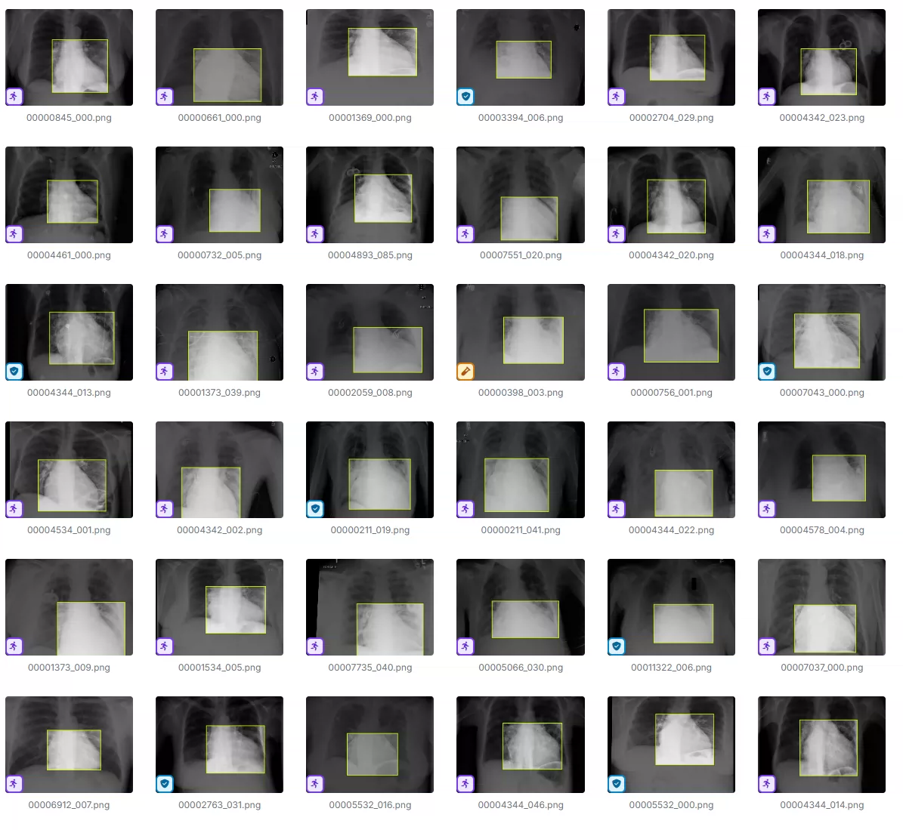
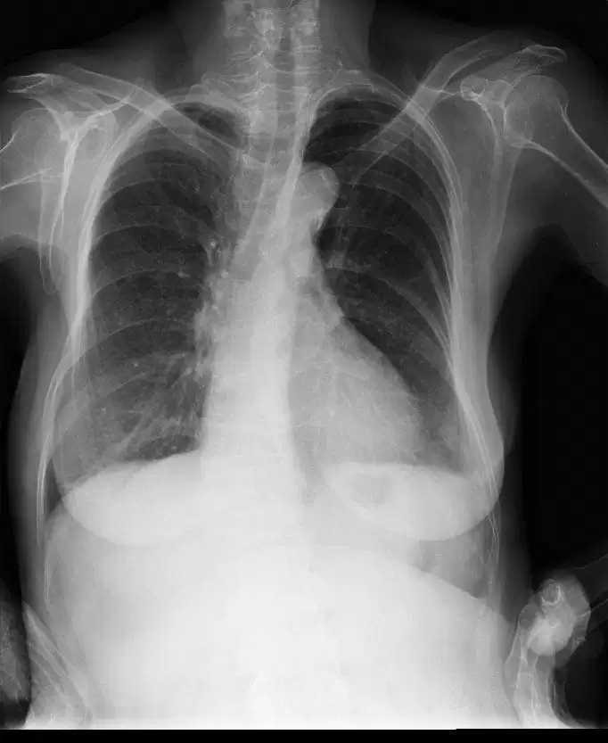
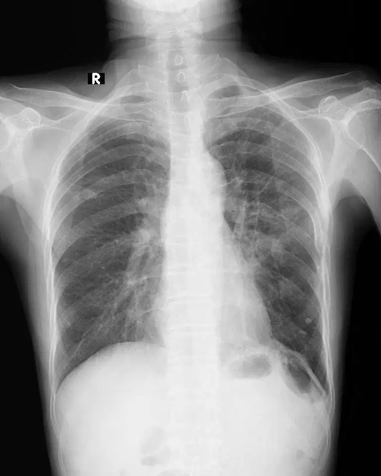

## Body

）识别

Totally 6k images, each labeled separately.
Divided into 14 categories, including 'Aortic enlargement', 'Atelectasis', 'Calcification', 'Cardiomegaly', 'Consolidation', 'ILD', 'Infiltration', 'Lung Opacity', 'Nodule-Mass', 'Other lesion', 'Pleural effusion', 'Pleural thickening', 'Pneumothorax', 'Pulmonary fibrosis'

"Aortic enlargement", "Atelectasis", "Calcification", "Cardiomegaly", "Consolidation", "Interstitial lung disease", "Infiltration", "Pulmonary shadow", "Nodule-mass", "Other lesion", "Pleural effusion", "Pleural thickening", "Pneumothorax", "Pulmonary fibrosis"

Electronic virtual products sold without return or exchange.

## Images

Here is a pay link on Stripe ( https://buy.stripe.com/3cs8yP7sY87d0vu9AB ). Please contact me lonlonago@foxmail.com after funding $89, and I will send you a complete data files , thank you!

